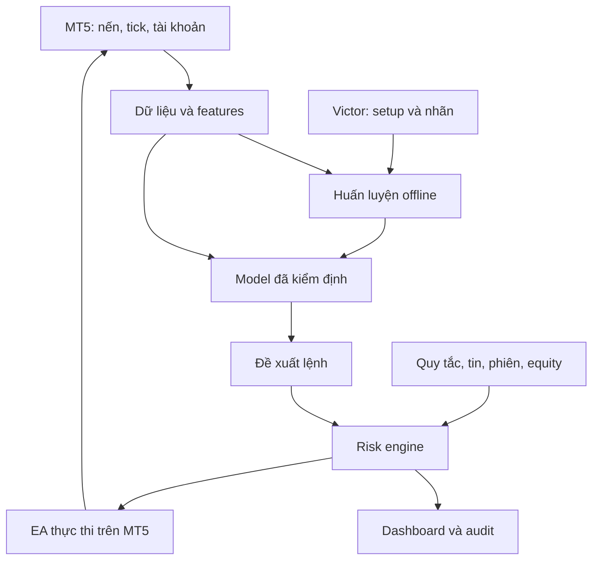

# OPC FTMO BOT — Thiết kế, QA và hướng dẫn triển khai V1

Ngày nghiên cứu: 27/09/2026. Chủ dự án: Victor Chuyền.

## 1. Quyết định thiết kế

Xây bot giao dịch ngắn hạn học từ dữ liệu nến và phương pháp của Victor, với bộ kiểm soát rủi ro độc lập. Đề xuất pilot: FTMO CFD 2-Step, MT5, một tài khoản và một sản phẩm. Đây là lựa chọn kỹ thuật để thử nghiệm, chưa phải khuyến nghị mua Challenge. Chưa có bằng chứng bot của dự án có lợi nhuận hoặc vượt FTMO.

FTMO cung cấp môi trường giao dịch mô phỏng; số dư danh nghĩa không phải tiền được chuyển vào tài khoản ngân hàng của trader. Phí Challenge, nếu mua, là chi phí thật. Không hiển thị “vốn thật được cấp” trong app. [S2]

Link đầu vào https://trader.ftmo.com/start-challenge không đọc được bằng công cụ nghiên cứu. Chưa QA checkout, đăng nhập, giá, thuế, phương thức trả tiền hoặc lựa chọn theo quốc gia. Báo cáo dựa vào tài liệu FTMO công khai. Không đăng ký, mua gói hay gửi lệnh trong lần nghiên cứu này. Không áp quy định FTMO Futures vào FTMO CFD.

## 2. Bảng quy tắc cần cấu hình

| Thuộc tính | CFD 2-Step | CFD 1-Step |
|---|---|---|
| Mục tiêu | Challenge 10%; Verification 5% | 10% |
| Lỗ ngày | 5% vốn ban đầu | 3% vốn ban đầu |
| Sàn lỗ tổng | Cố định: 90% vốn ban đầu | Số dư đầu ngày cao nhất, tối thiểu vốn ban đầu, trừ 10% vốn ban đầu |
| Ngày giao dịch tối thiểu | 4 ngày mỗi vòng đánh giá | Không có mục riêng tương đương trong Trading Objectives; có Best Day |
| Best Day | Không liệt kê cho 2-Step | Ngày lãi lớn nhất ≤50% tổng lãi của các ngày có lãi |

Theo Trading Objectives: equity phải bao gồm lãi/lỗ mở và chi phí; reset ngày 00:00 CE(S)T. Mục tiêu lợi nhuận cần đóng toàn bộ vị thế. Best Day vượt 50% chưa phải vi phạm tức thời, nhưng chưa đủ điều kiện hoàn thành. [S1]

2-Step có thời gian không giới hạn và Free Trial 14 ngày; trial là bản thực hành đơn giản hóa, không được mặc định toàn bộ điều kiện giống Challenge trả phí. Swing không được cung cấp cho 1-Step. [S2,S3]

Đề xuất 2-Step vì sàn tổng cố định giúp kiểm chứng risk engine đơn giản hơn. Đổi lại cần hai vòng. Không suy ra xác suất đỗ cao hơn khi chưa mô phỏng cùng một chiến lược trên hai bộ quy tắc.

## 3. Bot được phép đến đâu?

FTMO cho phép thuật toán/EA khi phù hợp giao dịch thực tế và quy định. EA mua từ bên thứ ba có thể trùng chiến lược với người khác và ảnh hưởng giới hạn phân bổ vốn. FAQ còn nêu giới hạn 200 orders đồng thời và 2.000 positions/ngày; đừng nhầm chúng với số yêu cầu sửa lệnh. [S4]

Các nhóm cấm cần xem nguyên văn: khai thác lỗi/độ trễ giá, phối hợp tài khoản để thao túng, dùng AI/công cụ gây lạm dụng, gap trading thuộc trường hợp cấm, rủi ro bất thường và phân bổ lãi giả tạo để né Best Day. Trang quy định nêu EA gây hơn 2.000 yêu cầu mở/sửa/đóng mỗi ngày là hyperactivity. Dịch vụ dành cho sử dụng cá nhân, không cho bên khác điều hành tài khoản hộ. [S5]

Thiết kế riêng của OPC: không latency arbitrage, martingale, grid bình quân lỗ, hedge giữa tài khoản, dịch vụ vượt Challenge hộ hoặc spam sửa SL theo mỗi tick. Đây là giới hạn sản phẩm V1; không tuyên bố FTMO cấm mọi chiến lược thuộc từng tên gọi này.

Trước pilot trả phí, chủ tài khoản nên gửi mô tả cụ thể cho FTMO để xác nhận cách triển khai AI/EA phù hợp. Không hiểu “cho phép EA” là phê duyệt mọi kiến trúc AI hoặc SaaS quản lý tài khoản.

## 4. Tin tức, phiên và giờ reset

Standard ở giai đoạn FTMO Account hạn chế mở/đóng trên sản phẩm bị ảnh hưởng trong ±2 phút quanh các tin được chỉ định, gồm cả khớp SL/TP. Evaluation không áp cửa sổ này nhưng vẫn chịu Forbidden Practices. Swing được miễn hạn chế tin này. [S6]

Standard FTMO Account phải đóng trước cuối tuần hoặc market break dài hơn 2 giờ. Evaluation và Swing có ngoại lệ; lịch cụ thể phụ thuộc sản phẩm, ngày lễ và cập nhật giao dịch. [S7]

Chính sách OPC đề xuất: dùng cùng bộ lọc sự kiện thận trọng ngay trong pilot để chiến lược không phụ thuộc vào điều kiện chỉ có ở Evaluation. Block entry trước sự kiện 15 phút; đóng vị thế bị ảnh hưởng và hủy pending trước 5 phút; mở lại sau 5 phút khi spread ổn định. Đây là buffer nội bộ, không phải quy định FTMO. Nếu đóng thất bại trước cửa sổ hạn chế, ghi incident và cảnh báo; không tháo SL để né quy tắc, không hứa có thể vừa tránh mọi vi phạm vừa tránh mọi tổn thất khi đã rơi vào tình huống này.

Lịch sự kiện cần nguồn được phép truy cập, danh sách instrument bị ảnh hưởng, timestamp UTC, thời điểm cập nhật và phiên bản. Chưa xác minh API lịch tin chính thức công khai của FTMO: adapter phải hỗ trợ nhập file lịch đã kiểm tra. Lịch thiếu/hết hạn → khóa lệnh mới. Một lịch “high impact” chung không tự động tương đương danh sách Restricted event.

Sử dụng timezone IANA Europe/Prague cho ngày FTMO; lưu dữ liệu UTC và hiển thị Asia/Ho_Chi_Minh. Không hardcode UTC+1, UTC+2 hay giờ server MT5 thành ngày FTMO. Kiểm thử DST mùa xuân/mùa thu, cuối tháng, nghỉ lễ và restart qua nửa đêm.

## 5. Kiến trúc vận hành



MT5 nằm trong danh sách nền tảng FTMO công khai, nhưng phải kiểm tra khả dụng trong đơn hàng cụ thể. [S8]

V1 chọn EA MQL5 làm chủ sở hữu duy nhất của vòng đời lệnh và kiểm soát rủi ro. Python train/inference chạy trên máy Windows/VPS của chủ tài khoản; frontend chỉ theo dõi và thay cấu hình đã kiểm tra. MT5 credentials không ra frontend, không gửi cho LLM. Không tạo endpoint giả “FTMO trading API”.

Python Integration chính thức của MetaTrader 5 cung cấp kết nối terminal và các hàm lấy trạng thái/dữ liệu/gửi yêu cầu; chọn dùng để lấy dữ liệu V1, không để Python và EA cùng phát lệnh. [S9]

Luồng inference đề xuất: Python ghi signal JSON vào thư mục dùng chung được chỉ định, ghi temp rồi rename atomic; EA đọc theo timer, kiểm tra TTL và schema. Cần kiểm chứng quyền đường dẫn/FILE_COMMON trên máy triển khai; không coi file đơn giản là queue đáng tin cậy nếu chưa có ACK và journal.

EA quản lý SL ở phía server, budget, daily ledger, news schedule đã tải sẵn, watchdog. Python mất kết nối → không có lệnh mới; EA vẫn quản lý vị thế. MT5/máy chủ ngừng hoạt động → chỉ bảo vệ phía server còn hiệu lực; gap/slippage vẫn có thể xuyên mức lỗ.

ONNX trong MQL5 là lựa chọn tối ưu sau này và có hỗ trợ Strategy Tester; phải kiểm tra operator, shape và độ tương đương trước khi chuyển model. WebRequest là đồng bộ và không chạy trong Strategy Tester: không thiết kế test phụ thuộc gọi HTTP live. [S10,S11]

Không hứa chạy MT5 native trong Docker Linux của AI Studio. AI Studio tạo web/API, source EA, simulator và hướng dẫn; compile EA và thử terminal phải thực hiện trong môi trường MT5 phù hợp. VPS Linux hiện có có thể host dashboard; Windows terminal cần môi trường riêng đã kiểm chứng.

## 6. Học từ phương pháp Victor

Chọn một setup trước: ví dụ pullback theo xu hướng hoặc breakout-retest. Các tên trên là ứng viên nghiên cứu, chưa được chứng minh hiệu quả. Anh mô tả điều kiện vào, trường hợp bỏ qua, điểm sai, SL, TP, phiên, khung nến và thời gian giữ lệnh.

Màn hình Replay ẩn phần tương lai. Mỗi nhãn gồm symbol, timestamp quyết định, timeframe, hướng, setup, entry dự kiến, SL, TP, thời gian hết hiệu lực, lý do chọn/bỏ qua. Thu cả lệnh thua và tình huống không trade. 30–50 ví dụ chỉ đủ làm rõ quy tắc, không đủ chứng minh model tổng quát.

Pipeline nghiên cứu:

1. Baseline A: quy tắc của Victor, không ML.
2. Baseline B: LightGBM lọc take/skip cho tín hiệu A; dự báo xác suất đạt TP trước SL trong thời gian giữ tối đa. LightGBM là thư viện ML, không phải bot sẵn có lợi nhuận. [S12]
3. Challenger C: Kronos, model chuỗi OHLCV có trọng số và fine-tune; kiểm tra thêm giá trị trên đúng dữ liệu FTMO. Không lấy đường nến dự báo làm lệnh trực tiếp, không coi dự báo đúng là có lãi. [S13]

V1 không bắt buộc C nếu B đủ để kiểm chứng. Dùng nến của terminal/sản phẩm FTMO cho giao dịch CFD; không thay bằng giá Binance và coi là tương đương. Tick volume có thể khác traded volume; lưu provenance và ý nghĩa field.

Feature chỉ dùng dữ liệu đã có tại quyết định: return, range/ATR, hình dạng nến, xu hướng đa khung, vị trí tương đối vùng giá, spread, phiên. Fit scaler bằng train-only. Nến khung cao chỉ được dùng sau khi đóng. TP và SL cùng nằm trong một nến mà thiếu ticks → kết quả ambiguous, xử lý bảo thủ và báo riêng.

Không huấn luyện lại trực tiếp trên lệnh vừa chạy rồi tự thay model. Training định kỳ ở chế độ shadow; lưu dataset hash, code commit, split, model version. Challenger chỉ được promote sau kiểm định và chủ tài khoản duyệt; giữ bản rollback. Mô hình pretrained có cutoff không rõ phải ghi hạn chế và dùng giai đoạn tương lai mới thu thập để kiểm tra.

## 7. Risk engine: hợp đồng tính toán

Ký hiệu: I là vốn khởi tạo; B0 là balance ở ranh giới ngày FTMO; E là equity hiện tại; H là mức cao nhất của I và các balance đã chốt ở ranh giới ngày. [S1]

```text
daily_floor = B0 - daily_rate * I
total_floor_2step = 0.90 * I
total_floor_1step = H - 0.10 * I
effective_floor = max(daily_floor, total_floor)
headroom = E - effective_floor
```

Balance/equity lấy từ terminal là nguồn vận hành; ledger đối chiếu độc lập, tránh trừ phí hai lần khi phí đã nằm trong balance. B0 phải tái dựng từ history đầy đủ nếu mất snapshot, không dùng balance lúc restart thay cho nửa đêm. History thiếu → HOLD. Deposit/withdrawal/reward/account reset yêu cầu xác minh event, không suy đoán từ thay đổi số dư.

Thiết kế safety margin riêng, khóa trước sàn; giới hạn không phải cam kết tổn thất tối đa khi giá gap. Tất cả vị thế thủ công và EA khác đều tính vào exposure của tài khoản; V1 khuyến nghị tài khoản chỉ có một executor. Không chỉ lọc magic number để tính lỗ.

Thông số nội bộ khởi đầu để test, không phải số tối ưu hay điều kiện FTMO:

| Tham số | Mặc định nghiên cứu |
|---|---|
| Risk một trade idea | 0,25% I |
| Risk đang mở cộng pending | Tối đa 0,50% I |
| Mức dừng lỗ ngày nội bộ | 1,00% I tính cả floating/chi phí |
| Dừng nghiên cứu khi drawdown tổng | 4,00% I |
| Số lệnh mới/ngày | Tối đa 5, không ép đủ số |
| Chuỗi thua | 3 trade ideas → dừng entry đến ngày sau |
| Requests giao dịch | Ngân sách nội bộ 300/ngày, giữ 100 cho xử lý bảo vệ |

Request budget phải đếm gửi thử, retry, sửa/hủy, qua restart; dự trữ không đảm bảo mọi lệnh thoát thành công. Hạn chế trailing update theo bước giá và thời gian. Khi entry budget hết vẫn cho hành động giảm rủi ro trong ngân sách dự phòng; gần cạn phải alert và ngừng entry sớm.

Lot sizing: dùng contract specs thực tế, tính tổn thất entry→SL theo account currency với API tính profit tương ứng, thêm phí và trượt giá dự kiến, làm tròn xuống volume_step. Lot nhỏ hơn min → SKIP; không làm tròn lên. Kiểm tra margin, stop/freeze level, filling mode, session. Không cố định giá trị pip cho vàng, FX và indices.

Trước entry, tính tổn thất tăng thêm từ giá mark hiện tại đến SL cho vị thế đang mở, cộng toàn bộ rủi ro pending có thể đồng thời khớp, cộng lệnh mới và buffer. Giá trị này phải nhỏ hơn headroom còn lại; không cộng lại khoản floating loss đã nằm trong E. Kiểm tra lại dưới lock ngay trước gửi, reserve risk cho lệnh in-flight, reconcile rồi release reservation.

## 8. Data contracts và state machine

Signal tối thiểu:

```json
{
  "schema_version": 1,
  "signal_id": "unique-id",
  "account_profile_id": "configured-profile",
  "symbol": "resolved-terminal-symbol",
  "bar_close_utc": "ISO-8601",
  "expires_at_utc": "ISO-8601",
  "side": "BUY_OR_SELL",
  "entry_policy": "MARKET_WITH_MAX_DEVIATION",
  "stop_price": "decimal-string",
  "take_profit_price": "decimal-string",
  "setup_version": "version",
  "model_version": "version",
  "feature_hash": "hash"
}
```

Model không được ghi account password, leverage, lot tùy ý hoặc override risk. Executor tự tính lot; stale quote, lệch account/symbol, thiếu SL, NaN, confidence không hợp lệ → REJECT với reason code.

Trạng thái: OBSERVE → PAPER → TRIAL_EXECUTION → CHALLENGE_EXECUTION. Mỗi lần chuyển chế độ có chủ tài khoản xác nhận đúng account/server/profile; không tự chuyển khi terminal login thay đổi. Trạng thái sự cố: PAUSED, DAILY_LOCK, RECONCILE_REQUIRED, RULE_BREACH_SUSPECTED. UI không tự tuyên bố PASSED: dùng ELIGIBLE_FOR_REVIEW cho đến FTMO xác nhận.

Order lifecycle: PROPOSED → RISK_RESERVED → SENT → ACK/PARTIAL/FILLED/REJECTED/UNKNOWN → CLOSED. Timeout gửi lệnh không đồng nghĩa lệnh chưa khớp. UNKNOWN phải đối chiếu orders, positions, deals; không gửi lại mù. Journal lưu trước khi gửi, khôi phục signal_id và reservation sau crash. Chỉ một executor được giữ account lease.

## 9. Giao diện đáp ứng nhu cầu trader

| Màn hình | Việc người dùng làm | Điều kiện nghiệm thu |
|---|---|---|
| Kết nối | Chọn server/account/profile | Hiện login che một phần, mode và dữ liệu thật/stale rõ ràng |
| Risk cockpit | Biết còn được chịu lỗ bao nhiêu | Equity, daily/total floor, headroom, reset countdown và timestamps |
| Chart + setup | Hiểu tại sao bot nhận/bỏ tín hiệu | Nến thật, marker quyết định, SL/TP, lý do và model version |
| Teach AI | Gắn nhãn phương pháp | Replay ẩn tương lai; lưu TAKE/SKIP và lý do |
| Positions | Theo dõi lệnh và chi phí | Balance khác equity; floating khác realized; không số ngẫu nhiên |
| Research | So sánh A/B/C | Cùng split, cùng phí; dữ liệu train/test phân biệt |
| Operations | Pause và xử lý lỗi | Phân biệt Pause entries với Close positions; ACK xác nhận kết quả |

Mục tiêu “1 phút cấu hình” chỉ áp khi terminal đã cài và account đã đăng nhập. “10 phút demo hiểu app” là UX walkthrough trên replay hoặc trial, không phải đủ thời gian chứng minh lợi nhuận.

## 10. Bộ QA bắt buộc

Các số dưới là fixture nhân tạo phục vụ kiểm thử, không phải kết quả giao dịch.

| ID | Tình huống | Kỳ vọng |
|---|---|---|
| R01 | 2-Step I=100.000, B0=102.000, E=98.000 | daily floor 97.000; tổng 90.000; headroom 1.000 |
| R02 | 1-Step I=100.000, H=104.000, B0=103.000 | daily 100.000; tổng 94.000; không hạ H khi balance giảm |
| R03 | 2-Step trước reset B0=100.000, balance=103.000, floating=-7.000 | E=96.000; sau reset daily floor=98.000: phải phát hiện nguy cơ trước reset |
| R04 | Balance dương nhưng equity qua sàn | Cảnh báo/khóa theo equity, không theo realized riêng |
| R05 | Equity bằng sàn hoặc sát sàn | Safety margin chặn trước, test chính xác decimal ở biên |
| R06 | DST và restart qua 00:00 Prague | Một ngày chỉ tạo một snapshot; không mất lịch sử |
| R07 | Partial close, commission, swap qua ngày | Ledger khớp terminal, không double count |
| R08 | Lệnh thủ công ngoài magic của bot | Vẫn tính vào exposure và giới hạn tài khoản |
| R09 | Best Day lớn hơn một nửa tổng ngày dương | Chưa eligible; không đánh dấu hard breach chỉ vì tỷ lệ |
| R10 | Hai signal đến đồng thời | Reserve dưới lock, tổng risk không vượt budget |
| E01 | Gửi thành công nhưng timeout ACK | Reconcile, không mở lệnh thứ hai |
| E02 | Partial fill và restart | Rebuild khối lượng còn lại đúng |
| E03 | SL không được chấp nhận | Không để vị thế không bảo vệ âm thầm; emergency policy và alert |
| E04 | Lot tính ra dưới minimum | SKIP, không tăng risk bằng làm tròn lên |
| E05 | Spread tăng/gap vượt SL | Ghi actual fill và loss, không ghi fill lý tưởng |
| E06 | Python chết | Ngừng entry, EA bảo vệ tiếp |
| E07 | Terminal mất mạng | Báo stale, không hiển thị heartbeat giả; reconcile khi trở lại |
| E08 | Hai executor cùng tài khoản | Lease ngăn executor thứ hai gửi lệnh |
| N01 | Standard FTMO Account quanh tin bị hạn chế | Flat và pending đã hủy trước buffer deadline |
| N02 | Calendar hết hạn/không map symbol | HOLD entries; báo lý do |
| N03 | Cuối tuần/nghỉ lễ đổi phiên | Dùng session đã xác minh, không hardcode Friday 23:00 |
| D01 | Nến chưa đóng hoặc khung cao chưa đóng | Không lọt vào features dùng cho quyết định |
| D02 | TP và SL cùng nến, không ticks | Ambiguous/bảo thủ; không mặc định TP trước |
| D03 | Đổi account, symbol suffix, contract | Profile invalidated, buộc reconcile |
| M01 | Shuffle ngẫu nhiên train/test chuỗi thời gian | Test phải fail cấu hình |
| M02 | Feature future shift/normalizer fit cả test | Leakage guard fail |
| M03 | Model mới kém baseline | Không promote |
| U01 | Mất feed dashboard | Hiện last update, STALE; dừng animation equity |
| U02 | Pause entries | Không hiểu nhầm đã đóng vị thế |
| C01 | Chuyển phase/account | Nạp đúng I/profile mới, không mang B0 cũ sang |

Mỗi test có fixture, expected, actual, log và trạng thái PASS/FAIL/BLOCKED. Danh sách trên là kế hoạch QA; chưa có bot để chạy các test này. Test MQL5 và Python cùng fixture để kiểm tra parity.

## 11. Kiểm định hiệu quả và lộ trình

G0 — Spec: Victor xác nhận setup, symbol, thời gian giữ; lưu rule profile và điều kiện hợp đồng thực tế.

G1 — Read-only: kết nối terminal, tải lịch sử, kiểm tra chất lượng, dashboard equity thật. Đối chiếu với terminal và Account MetriX bằng báo cáo/manual; chưa xác minh API MetriX công khai, không giả endpoint.

G2 — Simulator + guard: hoàn thành QA critical; mô phỏng bid/ask, phí, swap, spread biến động, rejection, latency và session. Test một nến OHLC lý tưởng không đủ cho scalping.

G3 — Research: chia train/validation/test theo thời gian; walk-forward; purge/embargo cho labels chồng lấn. Giữ test cuối chưa dùng chọn tham số. Báo net expectancy, profit factor, max equity drawdown, số trade ideas, phân bố theo phiên/regime, chi phí, tần suất vi phạm. Mô phỏng Challenge từ nhiều ngày bắt đầu; giữ tương quan cụm lệnh khi bootstrap, tránh xáo trộn lệnh độc lập làm quá lạc quan.

G4 — Shadow/Free Trial: chạy đủ phiên và đủ setup để đối chiếu thực thi. Gợi ý thu ít nhất 20 phiên và 100 trade ideas ngoài mẫu, không ép số và không coi đây là bảo chứng thống kê; có thể cần nhiều hơn hoặc nhiều trial. Trial 14 ngày là kiểm tra plumbing ban đầu.

G5 — Quyết định mua: chỉ khi không còn lỗi critical, dữ liệu/reconciliation sạch, kỳ vọng ròng ngoài mẫu có bằng chứng và drawdown trong budget nội bộ qua stress costs. Chủ tài khoản quyết định chi phí mất được. Không cam kết thời gian đỗ.

## 12. Prompt giao AI Studio / AI Dev

> Bạn là Senior Quant Developer, MQL5 Engineer và QA Engineer. Xây OPC FTMO Bot V1 theo toàn bộ tài liệu này. Đây là hệ thống nghiên cứu và thực thi EA cá nhân có kiểm soát, không phải bot cam kết vượt Challenge.
>
> Giữ frontend hiện có nếu phù hợp. Tách strategy/data/risk/execution. Scope đầu tiên: read-only MT5 adapter, replay simulator, risk engine theo profile, audit và dashboard. Sau đó mới thêm EA execution ở Trial. Không tự bật Challenge.
>
> Cấu trúc tối thiểu: apps/web; services/research; terminal/ea; packages/contracts; configs/rules; tests/fixtures; docs/runbooks. Chọn phiên bản dependency khả dụng, pin lockfiles và ghi nguồn/license. Không copy nguyên repo bot cộng đồng chưa audit.
>
> Triển khai model baseline quy tắc trước; LightGBM là challenger đầu tiên, Kronos adapter optional. Training offline, inference có TTL; model không được vượt risk engine. Signal và order lifecycle phải idempotent, có durable journal, account lease và recovery.
>
> Tạo rule profiles riêng cho 1-Step/2-Step/phase/account type. Một profile chưa xác minh phải chỉ cho OBSERVE. Guard hoạt động khi Python/UI chết. Không đặt secrets vào browser. Dữ liệu mock phải có nhãn REPLAY/SYNTHETIC và không trộn equity terminal.
>
> Viết code runnable, không để TODO trong risk/execution critical rồi báo hoàn thành. Tạo .env.example không chứa secrets, script setup Windows, hướng dẫn compile MQL5 bằng MetaEditor, Python venv, migrate journal, start/stop/recover; web/API có thể chạy môi trường dev độc lập. Không tuyên bố Docker Linux khởi chạy MT5 Windows native.
>
> Viết unit/integration tests theo bảng QA; dùng fixture parity Python/MQL5. Khi môi trường không có MT5, ghi BLOCKED cho compile/terminal integration và cung cấp bước chạy ngoài môi trường; không giả kết quả. Kiểm định chart/render và stale states bằng demo data riêng.
>
> Mỗi phase bàn giao: file thay đổi, lệnh chạy thực tế, output kiểm thử, giới hạn còn lại, bước kế tiếp. Definition of done V1: đọc tài khoản thật của terminal được cấp quyền, hiển thị đúng dữ liệu, replay kiểm chứng được, risk tests critical PASS, Trial execution có evidence trước khi cho chọn Challenge mode.

## 13. Hướng SaaS và affiliate

Giai đoạn đầu bán research journal, risk dashboard, replay và phần mềm khách tự vận hành. Không mặc định nhận mật khẩu hay điều hành tài khoản FTMO thay khách. SaaS gửi tín hiệu đồng loạt/copy trade cần xem xét riêng với điều khoản personal use, allocation và quyền sử dụng dữ liệu; chưa kết luận được phép. [S4,S5]

Model thương mại cần tách doanh thu membership, hoa hồng affiliate và P&L giao dịch. Không dùng kết quả backtest làm testimonial tài khoản thật; không gắn “FTMO approved” khi chưa có xác nhận. Phải kiểm tra license code, model weights và quyền phân phối dữ liệu trước bán.

LAUNCH sơ bộ: faceless được qua screen demo; chưa có follower vẫn tiếp cận trader qua nội dung QA; nghiên cứu có thể bắt đầu miễn phí nhưng vận hành/VPS/dữ liệu/phí Challenge không phải vốn 0; AI hỗ trợ đóng gói nhưng cần kiểm thử quant/MQL5; tự động hóa giảm giám sát thường nhật nhưng vẫn cần xử lý sự cố; scale phụ thuộc support, license và quy định, không vô hạn.

## 14. Các thông tin cần Victor chốt

1. Sản phẩm ưu tiên: XAUUSD, FX, indices hay crypto CFD; symbol thực tế trong terminal.
2. Setup chủ lực, khung quyết định, thời gian giữ lệnh và phiên giao dịch.
3. Trial hay đã có Challenge; 1/2-Step, Standard/Swing, currency/size/phase/server.
4. Máy Windows/VPS dùng cho MT5 và mức chi phí chấp nhận.
5. Mẫu lệnh thắng/thua/bỏ qua hoặc journal để chuẩn hóa phương pháp.

Không cần gửi mật khẩu vào chat. Chưa có các thông tin này vẫn code được simulator, schema, dashboard và risk fixtures; chưa thể xác nhận chiến lược hay hiệu quả tài khoản cụ thể.

## 15. Nguồn kiểm tra

Tất cả truy cập ngày 27/09/2026. Điều khoản đơn hàng/hợp đồng áp dụng cho tài khoản và cập nhật FTMO phải được đối chiếu lại trước sử dụng; đây không phải chứng nhận của FTMO.

- S1 — Trading Objectives: https://ftmo.com/en/trading-objectives/
- S2 — 2-Step và bản chất tài khoản mô phỏng: https://ftmo.com/en/2-step-challenge/
- S3 — 1-Step và Swing: https://ftmo.com/en/1-step-challenge/
- S4 — EA/strategy: https://ftmo.com/en/faq/which-instruments-can-i-trade-and-what-strategies-am-i-allowed-to-use/
- S5 — Forbidden Practices và personal use: https://ftmo.com/en/forbidden-trading-practices/
- S6 — Tin tức: https://ftmo.com/en/faq/can-i-trade-news/
- S7 — Overnight/weekend: https://ftmo.com/en/faq/do-i-have-to-close-my-positions-overnight-or-before-the-weekend/
- S8 — Platforms: https://ftmo.com/en/faq/which-platforms-can-i-use-for-trading/
- S9 — Python/MT5: https://www.mql5.com/en/docs/python_metatrader5
- S10 — MQL5 ONNX: https://www.mql5.com/en/docs/onnx
- S11 — WebRequest: https://www.mql5.com/en/docs/network/webrequest
- S12 — LightGBM: https://github.com/lightgbm-org/LightGBM
- S13 — Kronos: https://github.com/shiyu-coder/Kronos
- S14 — Terms landing, không thay cho hợp đồng cụ thể: https://ftmo.com/en/terms-and-conditions/

Trạng thái: hoàn thành nghiên cứu và đặc tả QA. Chưa xây/compile/chạy bot, chưa backtest hiệu quả, chưa kiểm tra tài khoản đăng nhập hoặc thực hiện thanh toán/giao dịch.
