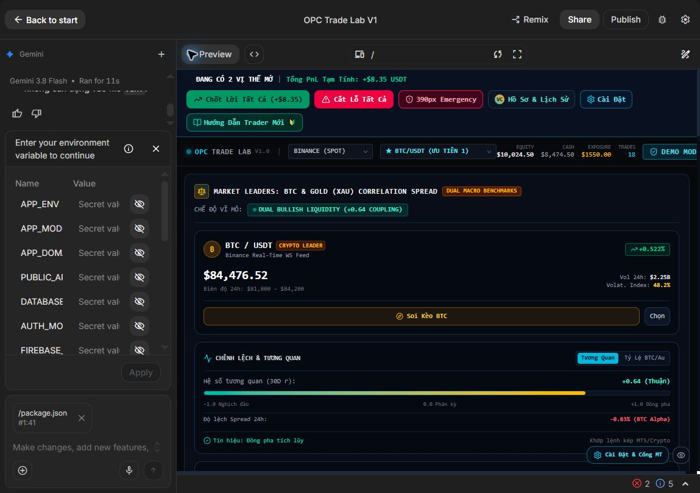
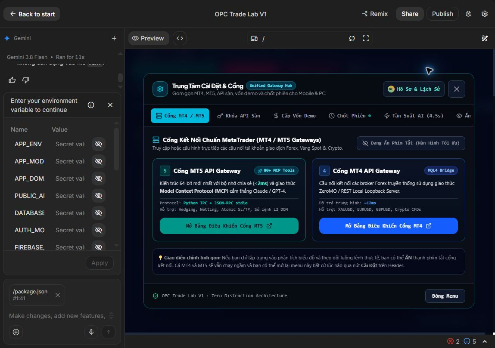

# OPC Trade Lab V1 → Lucky: đánh giá bản AI Studio

Ngày 2026-09-27. Nguồn: https://aistudio.google.com/u/2/apps/25552bee-436e-428e-9beb-9f6297f00aa2?showPreview=true&showAssistant=true

## Quyết định

**Phát triển tiếp có chọn lọc: giữ giao diện/component hữu ích; thay lõi dữ liệu, xác thực tài khoản và thực thi giao dịch.** Không viết lại toàn bộ UI chỉ vì backend chưa đạt, cũng không coi code hiện tại là hệ thống trade thật. Quyết định giữ component cụ thể còn phụ thuộc kiểm tra bản source đầy đủ và build/test cục bộ.

Không sửa app gốc, không publish, không bật auto/live, không nhập credential, không đặt hoặc đóng lệnh trong lần kiểm tra này.

## Bằng chứng và phạm vi

Đã đọc trực tiếp toàn bộ `server.ts` (682 dòng), sao chép `src/App.tsx` từ editor và kiểm tra các đoạn vòng AI, đọc `package.json`. Có thư mục backend/tests trong cây file nhưng chưa đọc hết, chưa chạy test hoặc xác nhận backend Python được preview sử dụng. Nội dung Gemini nói “Built” không được dùng làm bằng chứng tính đúng đắn.

Đã bấm Export → Download ZIP; chưa xác nhận được file tải về. Không bypass chính sách trình duyệt để truy cập trang quản lý download. Đã đề nghị Victor cung cấp ZIP/path để triển khai trên bản sao cục bộ.

## Các bước giao diện đã xem

1. **Dashboard — hiển thị được, độ tin cậy nhãn dữ liệu chưa đạt.** Có cấu trúc dữ liệu thị trường, tài khoản, nhật ký và risk center. Nhãn LIVE, DEMO, PAPER cùng tồn tại mà chưa tách nguồn từng dữ liệu rõ ràng. Ở chiều rộng preview hiện tại phần header phải bị cắt; chữ thống kê nhỏ. Chưa kết luận lỗi responsive ở toàn màn hình/mobile.

2. **Cài đặt → Cổng MT4/MT5 — mở được, thông tin kết nối chưa được chứng minh.** Gom nhóm gateway dễ tìm, có nút đóng và nhãn nút trong cây accessibility. Hiển thị “80+ MCP tools”, “<2ms”, “~12ms” và tuyên bố chạy ngầm, nhưng code verify được kiểm tra không thực hiện kết nối terminal.

3. **Code — truy cập được; chưa build/test.** `dev`/`start` chạy `tsx server.ts`; `build` chỉ là `vite build`; `lint` là `tsc --noEmit`. Không có script test trong package.json đã đọc, dù cây file có thư mục tests. Chưa xem đây là lỗi test thất bại.

Accessibility: một số nút có nhãn rõ trong cây accessibility; rủi ro chữ nhỏ, thông tin dày và clipping trong khung preview. Chưa kiểm tra keyboard tab order, focus trap của modal, contrast bằng số, screen reader hay WCAG compliance. Hai ảnh lưu là đúng ảnh từ browser và đã mở lại kiểm tra; giới hạn khung preview được giữ nguyên, không giả làm ảnh toàn app.

## Phát hiện quan trọng từ mã nguồn

| Mức | Vị trí tại bản editor đã xem | Bằng chứng | Hành động cho Lucky |
| --- | --- | --- | --- |
| Chặn sử dụng live | server.ts:412,443 | MT4/MT5 verify trả success=true với số dư cố định và latency=Math.random; không gọi terminal ở các handler đó | Thay bằng adapter chỉ đọc thật; mất kết nối phải trả disconnected/unknown |
| Chặn tuyên bố hiệu quả | src/App.tsx:450–548 | Vòng setInterval tạo vị thế ở bước 4, bước 5 chọn `Math.random() < 0.70`, sinh PnL rồi POST history | Xóa khỏi execution thật; nếu giữ demo minh họa phải dán nhãn synthetic, tách sổ |
| Chặn nhãn giá vàng live | server.ts:575–584 | XAUUSD biến động bằng Math.random mỗi 2.5 giây | Chỉ dùng giá broker có timestamp/source; không giả lập khi mất nguồn mà giữ nhãn live |
| Chặn xác thực production | server.ts:617 | auth/login trả success=true mà không kiểm tra credential trong handler | Không dùng như đăng nhập bảo mật; thiết kế auth local phù hợp và kiểm tra quyền server |
| Chặn bằng chứng giao dịch | server.ts:521,634 | Lịch sử khởi tạo sẵn, lưu vào mảng; POST nhận PnL từ client | Ledger bền vững từ order/deal broker; dữ liệu seed nằm riêng, không gọi là lịch sử thật |
| Chặn trạng thái live không rõ | server.ts:264,348 | /me gán live_execution_unlocked=true; nhánh verify sàn khác Binance trả success mà không xác thực | Fail-closed, tách capability/config khỏi trạng thái broker đã kiểm chứng |

Các phát hiện là static code audit, không phải tái hiện tấn công hay giao dịch broker. Preview có mã gọi Binance WS/API thực; chưa đối soát timestamp/giá với nguồn độc lập, không phủ nhận mọi tick BTC đều thật nhưng cũng không chứng nhận toàn bộ luồng live. `INIT_SYNC` gán CONNECTED và BINANCE_REAL_WS mà không kiểm tra kết nối upstream tại nhánh đó — cần tách trạng thái socket client và nguồn thị trường.

## Khớp và lệch so với plan

- Giữ làm nền: theme dashboard tối, chia khối thị trường/risk/log, modal cài đặt gateway, ý tưởng truy vết signal → order → ledger.
- Thay phạm vi: Binance spot/Polymarket/ETH/SOL không phải lõi giai đoạn 1. Lucky cần BTCUSD CFD, XAUUSD, WTI spot CFD, EURUSD, GBPUSD, USDJPY qua terminal MT4/5. Không coi BTCUSDT spot là BTCUSD CFD.
- Ba phương pháp trên UI (complete-set arbitrage, momentum lag, market making) không đồng nhất với ba nhóm đã đưa vào plan nghiên cứu. Không tự đổi plan theo demo.
- Paper simulation, broker demo và broker live phải là ba chế độ khác nhau. Dữ liệu thị trường live không có nghĩa giao dịch live.
- Tần suất animation/refresh 1–60 giây không phải bằng chứng chiến lược scalping/swing. Trigger giao dịch cần gắn dữ liệu và đặc tả chiến lược, không theo chu kỳ trình diễn.

## Outline thực hiện trên bản sao sau khi có source

1. Lưu bản snapshot, kiểm tra secret trước khi đưa vào Git; đọc backend/tests/license, build và test baseline trong môi trường không có credential trading.
2. Tách reusable UI, sửa nhãn chứng cứ; khóa các nút giao dịch khi chưa có adapter. Loại xác nhận kết nối giả và số liệu hiệu quả ngẫu nhiên khỏi chế độ sử dụng thực tế.
3. Chuẩn hóa sáu sản phẩm, account identity, market timestamp và adapter terminal chỉ đọc; không hardcode broker symbol/suffix/contract size.
4. Thêm risk gate server, intent ID, audit ledger và semi-auto approval; chỉ triển khai order execution sau khi Victor chốt giới hạn rủi ro, account và rule strategy.
5. Test mất nguồn, sai tài khoản, duplicate intent, broker rejection, restart; rồi demo broker có bằng chứng đối soát. Live là cổng nghiệm thu riêng.

Chưa hứa thời gian, tỷ lệ code tái dùng hoặc kết quả lợi nhuận khi chưa có baseline đầy đủ.
